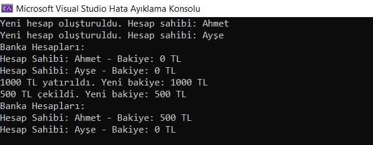

# cpp-banka-hesap-yonetimi-uyg
Bu program, basit bir banka hesap yönetimi uygulamasını simüle eder. Her bir banka hesabı, hesap sahibinin adı (`owner`) ve bakiyesi (`balance`) ile temsil edilir.

# `BankAccount` Sınıfı`
- `BankAccount` sınıfı, bir banka hesabını temsil eder.
- `owner`: Hesap sahibinin adını, `balance`: Hesabın bakiyesini tutar.
- `deposit(double amount)`: Belirtilen miktar kadar para yatırma işlemini gerçekleştirir.
- `withdraw(double amount)`: Belirtilen miktar kadar para çekme işlemini gerçekleştirir.
- `getOwner() const`: Hesap sahibinin adını, getBalance() const: Hesabın bakiyesini döndürür.

  # `Bank` Sınıfı
- `Bank` sınıfı, birden çok `BankAccount` nesnesini yönetir.
- `createAccount(const std::string& owner)`: Yeni bir banka hesabı oluşturur ve listeye ekler.
- `displayAccounts() const`: Mevcut banka hesaplarını listeler.
- `findAccount(const std::string& owner)`: Belirtilen isme sahip hesabı bulur.
 

  # `main` Fonksiyonu
- `main` fonksiyonu, `Bank` sınıfını kullanarak bir banka uygulamasını simüle eder.
- İlk olarak, **"Ahmet"** ve **"Ayşe"** adında iki banka hesabı oluşturulur ve listelenir.
- **"Ahmet"** hesabına 1000 TL yatırılır ve 500 TL çekilir.
 - Son durumda hesaplar tekrar listelenir.
    
**Bu program, basit bir banka hesap yönetimi uygulamasını simüle eder ve temel bankacılık işlemlerini gerçekleştirir.**

# Türkçe Karakter Desteği
- `setlocale(LC_ALL, "Turkish");` ifadesi ile Türkçe karakter desteği sağlanır.

# Ekran Resmi

# Bilgilendirme
**---------------------------------------------------------**
| Herkese Açık | Geliştirilebilir | Zyra Software|
|---------|---------|---------|
| Açık | Geliştirilebilir |@zyrasoftware |

